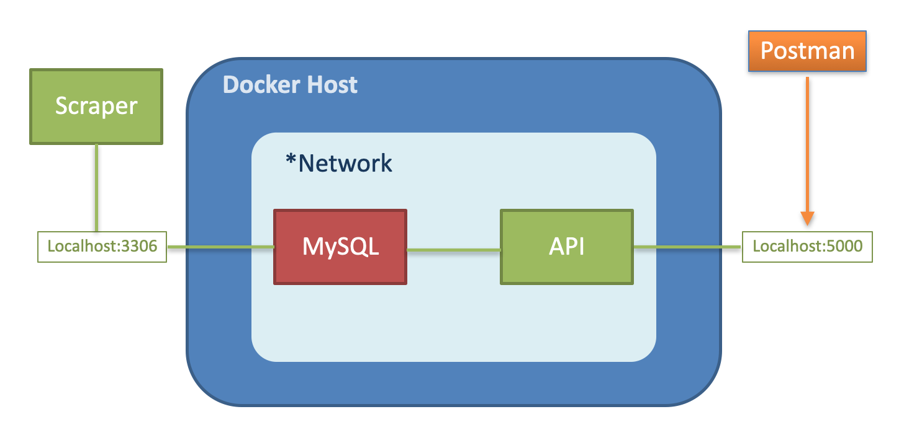

# Mobile01 Game

本專案為 Trainee Program 之結業 Side project。應用自學之工具建置 ETL 流程。

## 專案目的
此專案爬取 mobile01 遊戲版的文章資訊，再將資料儲存於資料庫。並提供 API ，讓使用者可以輕鬆查詢遊戲論壇最新資訊。
## 架構
分成三個主要的components, 分別為：爬蟲程式（Scraper）、資料庫（MySQL），以及 API。  
  
其中 MySQL DB 與 API，使用 Docker 架設服務，且以 docker-compose 進行部署，以利專案的環境建置與未來擴增。
  

## 運作流程
### Scraper
爬蟲程式會進入 mobile01 的 [遊戲版](https://www.mobile01.com/forumtopic.php?c=23)，並且開始逐頁包含標題、文章ID、發文者、文章類別、留言數以及文章超連結等等，在每次換頁間也預留1.5秒，避免過頻繁的訪問導致連線中斷。

### MySQL
在爬蟲程式運行完畢後，資料會寫進資料庫。以文章 ID 作為 key，若是全新的文章會直接加入 table，已經存在的文章則會以 update 的方式更新資訊。

### API
API 以 Python 的 flask 套件進行開發，並提供數個 GET request 讓使用者查詢資料。如以下兩範例：
- **most_feedback**  
回傳目前回覆數最高的文章ID、標題以及其收到的回覆數。

- **like_article_title**  
回傳標題包含特定關鍵字的文章。以下圖為例，若於 GET request 發送的關鍵字為“荒野”，API 則會回傳所有標題中有包含“荒野”兩字的所有文章。
